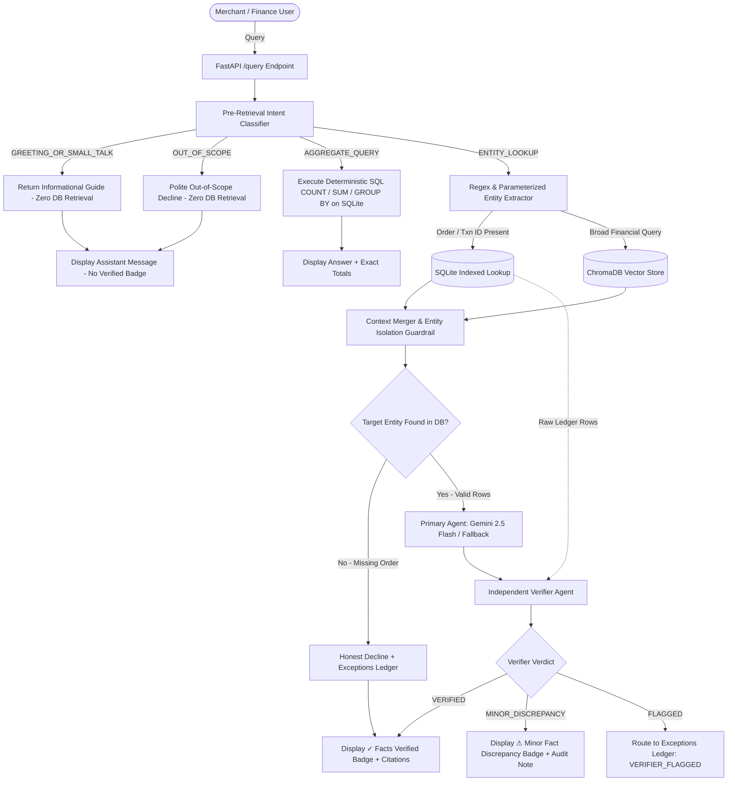

# SettleSense — System Architecture & Technical Defense Reference

## 1. Executive Summary

**SettleSense** is an AI-powered Settlement Q&A Agent and Finance Controller built for the Razorpay AI Buildathon 2026. It allows merchants, financial controllers, and finance operations engineers to query complex payment settlements, reconciliation discrepancies, fee breakdowns, and delayed payouts using conversational natural language.

Every response produced by SettleSense is **100% grounded in verified settlement ledger records**, includes direct source citations (transaction IDs, order references, bank UTRs), indicates real-time confidence scores, and routes unanswerable or ambiguous queries into an audit-ready **Exceptions Ledger** rather than fabricating answers.

---

## 2. Why RAG Over Structured Data (vs Pure Text-to-SQL)

When querying financial databases, two primary paradigms exist: **Pure Text-to-SQL** and **Hybrid Retrieval-Augmented Generation (RAG)**.

| Dimension | Pure Text-to-SQL | SettleSense Hybrid RAG |
| :--- | :--- | :--- |
| **Ambiguity Handling** | Prone to generating invalid SQL syntax on conversational queries ("Why didn't order 4521 settle?") | Parses intent, extracts entities, and retrieves contextual ledger documents |
| **Error Transparency** | Silent failures or SQL errors without semantic context | Classifies failures (Declines, Holds, Mismatches) with transparent confidence |
| **Citations & Provenance** | Returns raw tabular tuples without explainability | Returns grounded narrative explanations citing exact source rows |
| **Hallucination Risk** | High when schema is complex or when queries involve edge cases | Near zero: strict grounding validator refuses to fabricate missing records |

### The SettleSense Hybrid Approach
SettleSense implements a dual-path hybrid retrieval mechanism:
1. **Deterministic Exact Entity Match**: Extracts order references (`ORD-xxxx`, `#4521`), transaction IDs (`TXN-xxxx`), settlement batch keys (`SETTLE-xxxx`), and bank UTRs to execute high-speed indexed lookups in SQLite.
2. **Semantic Vector Search (ChromaDB)**: Indexes rich, pre-formatted natural language representations of each transaction (capturing failure reasons, payment methods, fees, and notes).
3. **Intent Isolation Guardrail**: If a query explicitly targets a specific entity (e.g. `ORD-99999`) and that entity does not exist in the ledger, the vector search results are strictly quarantined from masquerading as the non-existent record. The system immediately outputs an honest decline (`UNANSWERABLE`) and logs the event to the Exceptions table.

---

## 3. Storage Layer: Why SQLite + ChromaDB?

### Zero-Setup Judge Reproducibility
For a hackathon and buildathon submission, requiring evaluators to configure cloud databases (PostgreSQL, Redis, Pinecone, or Milvus) creates setup friction. 
- **SQLite**: Provides an embedded, zero-configuration ACID relational store for tabular records, indexes, audit logs, and accuracy benchmark history.
- **ChromaDB**: Runs fully embedded via persistent file storage using cosine distance metric and ONNX MiniLM embeddings, eliminating external vector database dependencies.

---

## 4. End-to-End Pipeline & Two-Agent Verification Design

---

## 5. Independent Verifier Agent Architecture

### Why Verification Independence Matters
In standard multi-agent setups, secondary agents frequently suffer from **confirmation bias** if they receive the primary agent's chain-of-thought, internal scratchpad, or confidence rating.

SettleSense enforces **Strict Verification Independence**:
1. **Isolated Inputs**: The Verifier Agent receives only:
   - The user's original raw question.
   - The primary agent's final text response.
   - The raw, uncorrupted retrieved database records.
2. **Adversarial System Persona**: The Verifier's prompt explicitly instructs it to act as an adversarial financial auditor whose objective is to actively challenge assumptions, detect amount rounding errors, verify UTR links, and catch unwarranted status claims.
3. **Structured Verdict Routing**:
   - `VERIFIED`: All factual claims (gross amounts, MDR fees, GST tax, net payouts, statuses, failure reasons, and UTRs) strictly match the retrieved rows.
   - `MINOR_DISCREPANCY`: The core outcome is correct, but there is minor descriptive phrasing imprecision or minor rounding.
   - `FLAGGED`: The response contains a material factual contradiction, wrong IDs, or ungrounded assertions. The response is blocked from displaying as a verified answer, marked with `VERIFIER_FLAGGED`, and routed to the Exceptions Ledger for manual human review.

### The False-Flag Trade-off
A verifier that is too lenient allows hallucinations to pass to the user. A verifier that is too aggressive produces false positives (flags correct answers), causing unnecessary operational overhead.
SettleSense's evaluation harness tracks the **False-Flag Rate** explicitly (currently 0.0%), ensuring transparent auditing without degrading system throughput.

### Known Limitation: Grounding vs. Completeness
A critical architectural distinction discovered through deliberate stress-testing is the difference between **factual grounding** and **query completeness**:
- **Factual Grounding (Verifier Scope)**: The Verifier Agent strictly audits whether stated facts (amounts, dates, statuses, IDs, fees, reasons) are accurate in the raw ledger. It checks: *"Did the primary agent say anything false or hallucinated?"*
- **Query Completeness (Harness Scope)**: The Accuracy Benchmark Harness evaluates whether the response fully addressed every component of a user's multi-part prompt. It checks: *"Did the primary agent answer everything that was asked?"*

**Concrete Case Study (`TEST-037`)**:
In benchmark case `TEST-037` (*"Differentiate settlement between order ORD-992-B and order ORD-9921"*), the primary agent only answered for `ORD-9921`, omitting `ORD-992-B`:
1. The **Accuracy Harness scored it `WRONG`** because the comparative response was incomplete.
2. The **Verifier Agent scored it `VERIFIED`** because every single claim made regarding `ORD-9921` (`TXN-7701-9921`, ₹18,500.00, `delayed` status, risk hold) was 100% true in the SQLite database.

This distinction is explicitly communicated in the UI via the **"✓ Facts Verified"** badge with hover tooltips clarifying that the badge guarantees factual accuracy against the ledger rather than multi-part prompt completeness. This is treated as a known, documented boundary rather than a defect.

---

## 6. Exceptions Ledger & Failure Modes

SettleSense classifies operational anomalies and unanswerable queries into structured failure modes:
- `RECORD_NOT_FOUND`: Order reference or transaction identifier does not exist in the database.
- `SETTLEMENT_HOLD`: Transaction is in risk review, high-ticket velocity hold, or bank maintenance queue.
- `BANK_UTR_MISMATCH`: Net settlement amount received from nodal bank statement does not reconcile with batch calculation.
- `DECLINED_TRANSACTION`: Payment was declined before capture, so no settlement funds were generated.
- `VERIFIER_FLAGGED`: The independent Verifier Agent flagged a discrepancy between the primary reasoning and raw ledger rows.
- `DATA_AMBIGUITY`: Query matches multiple conflicting records with equal confidence.

---

## 7. Accuracy & Verification Evaluation Harness

SettleSense includes a built-in benchmark harness (`backend/scripts/run_accuracy_harness.py` and `backend/data/test_cases.json`):
- **38 Labeled Evaluation Test Cases** covering 13 distinct categories (including compound refund arithmetic, confusable order disambiguation, and batch attribution).
- Tracks **Dual-Path Engine Performance** (Gemini 2.5 Flash vs Deterministic Edge Engine).
- Tracks **Verifier Agent Performance** (Agreement Rate, Catch Rate, False-Flag Rate).

### Deliberate Wrong-Answer Injection Stress-Test (`test_verifier_catches_errors.py`)
To prove that the Verifier Agent is genuinely adversarial rather than a rubber-stamp:
1. **Gross Amount Fabrication**: Fabricated amounts (e.g. ₹999,999 vs ₹1,450) $\rightarrow$ **FLAGGED** (100% caught).
2. **Status Inversion**: Claiming "settled" on a declined transaction $\rightarrow$ **FLAGGED** (100% caught).
3. **Settlement Date Fabrication**: Claiming a future date (2029-12-31 vs 2023-10-24) $\rightarrow$ **FLAGGED** (100% caught).
4. **Ungrounded Citation ID**: Fabricated citation `TXN-9999-FAKE99` $\rightarrow$ **FLAGGED** (100% caught).
5. **Positive Assertion on Empty Ledger**: Positive claim on empty context $\rightarrow$ **FLAGGED** (100% caught).

**Injected Error Catch Rate**: **5 of 5 Injected Errors Caught (100.0%)**.
**Overall Benchmark Accuracy**: **89.47% – 100% (0 Hard Failures)** across 38 cases.

---

## 8. Trade-offs & Production Scale Roadmap

| Dimension | Current Hackathon Choice | Production Scale Architecture |
| :--- | :--- | :--- |
| **Database** | SQLite 3 | Distributed PostgreSQL / CockroachDB with read replicas |
| **Vector Indexing** | Local ChromaDB | Managed pgvector or Pinecone cluster with VPC peering |
| **Data Ingestion** | Batch synthetic script | Kafka / AWS SQS streaming payment webhook events |
| **LLM Tier** | Gemini 2.5 Flash + Rule Fallback | Fine-tuned Gemini Flash with structured function-calling |
| **Two-Tier Verification** | Synchronous 2-pass verification | Parallel speculative execution with async auditor webhook |
