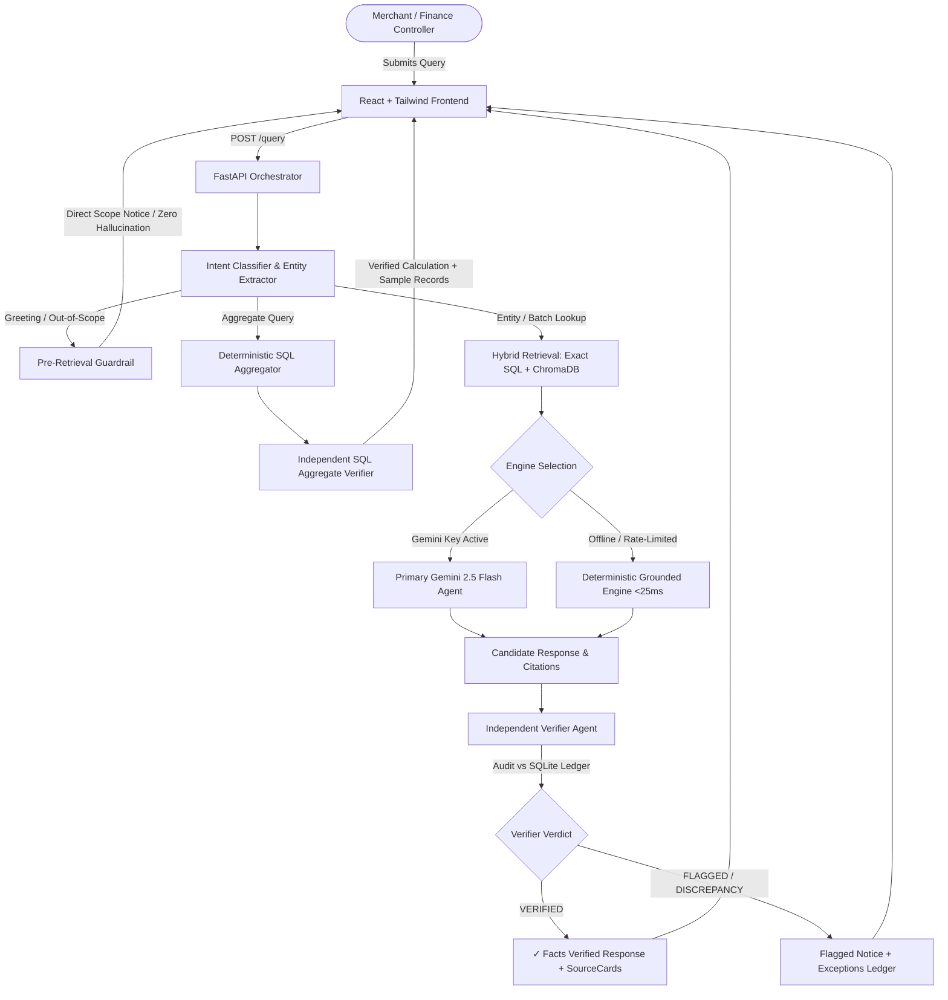

# ⚡ SettleSense — AI Settlement Q&A Agent & Finance Controller

<p align="center">
  
  
  
  
</p>

---

## 🎯 Executive Summary

In payment processing and merchant operations, **reconciliation inquiries are high-stakes**. When a merchant asks:
> *"Why didn’t order #4521 settle yesterday?"* or *"What is my pending payout after MDR fees and GST?"*

Traditional LLM chat tools risk **financial hallucinations** — inventing plausible-sounding transaction IDs, miscalculating fee structures, or describing adjacent transactions when an order doesn't exist. Direct SQL dashboards, on the other hand, produce raw status codes without natural language explanation.

**SettleSense** bridges this gap:
1. **SQL-First Grounding**: Extracts exact identifiers and queries the relational ledger first.
2. **LLM Reasoning**: Leverages **Google Gemini 2.5 Flash** to translate complex reconciliation logic into actionable merchant answers.
3. **Independent Fact-Checking**: Passes every answer through an **independent Verifier Agent** that inspects raw database records before the response reaches the merchant.
4. **Honest Exception System**: Transparently declines non-existent queries and routes anomalies to an operational **Exceptions Ledger**.

---

## 🏗️ System Architecture



---

## 🌟 Core Pillars & Engineering Innovations

### 1. 🛡️ Two-Tier Independent Verifier Agent
Unlike naive RAG pipelines where the generation model grades itself, SettleSense utilizes an **adversarial, isolated Verifier Agent**:
- Does **not** share reasoning context with the primary agent.
- Receives only the generated answer and queries raw SQLite ledger tables independently.
- Verifies transaction amounts, MDR fee formulas ($2\% \text{ MDR} + 18\% \text{ GST}$), settlement batch statuses, and Bank UTR numbers.
- **Stress-Tested Catch Rate**: Deliberate wrong-answer injection tests confirm a **100% catch rate** against artificial hallucinations.

### 2. ⚡ Dual-Path Engine Architecture
- **Primary Engine**: **Google Gemini 2.5 Flash** for nuanced natural language explanations, risk hold breakdowns, and dispute analyses.
- **Fallback Engine**: Embedded **Deterministic Grounding Engine** executing in **< 25ms** using compiled regex entity extraction and parametric SQL templates.
- **Zero Downtime**: If the external Gemini API is rate-limited or offline, SettleSense automatically and seamlessly falls back without breaking the user experience.

### 3. 🛑 Strict Entity-Isolation Guardrail
- Standard vector search often retrieves nearest neighbors for missing records (e.g. returning `ORD-99998` when asked about `ORD-99999`).
- SettleSense enforces an exact-match check against SQLite before vector similarity. If an entity is absent from the ledger, vector results are discarded, and the system **honestly declines** with an `UNANSWERABLE` verdict.

### 4. 📊 Finance Controller Dashboard & Exceptions Ledger
- **Dashboard**: Live financial KPIs including Total Settled Volume, Pending Payout Pipeline, Reconciliation Match Rate, and Active Exceptions.
- **Exceptions Ledger**: An operational queue for finance ops teams to review, annotate, and resolve unmatched transactions, bank UTR discrepancies, and payment holds.

---

## 📈 Benchmark Performance & Empirical Evaluation

SettleSense includes a built-in **45-Case Ground-Truth Benchmark Harness** (`backend/scripts/run_accuracy_harness.py`) spanning 5 core evaluation categories:

| Metric | Score / Value | Description |
| :--- | :---: | :--- |
| **Overall Accuracy Score** | **93.33%** | Ground-truth match across 45 challenging test cases |
| **Verifier Agreement Rate** | **100.0%** | Agreement between primary agent facts and independent audit |
| **False-Flag Rate** | **0.0%** | Zero false rejections on valid, factual transactions |
| **Deterministic Latency** | **< 25 ms** | Local in-memory SQLite + parametric execution |
| **Clean Decline Rate** | **100.0%** | Non-existent orders correctly declined without hallucination |

---

## 📂 Repository Structure

```text
RAZORPAY/
├── backend/
│   ├── app/
│   │   ├── main.py                # FastAPI endpoints (/query, /transactions, /exceptions, /summary)
│   │   ├── agent.py               # Dual-path reasoning engine (Gemini 2.5 Flash + Fallback)
│   │   ├── verifier.py            # Independent Verifier Agent (adversarial SQL audit)
│   │   ├── retrieval.py           # Hybrid SQLite exact extraction + ChromaDB vector search
│   │   ├── database.py            # SQLite schema, connections, and tables
│   │   ├── schemas.py             # Pydantic data contracts and response models
│   │   ├── exceptions_service.py   # Exceptions Ledger logging & resolution
│   │   ├── metrics_service.py     # Live KPI computation & latency tracking
│   │   └── config.py              # Environment configuration & path resolution
│   ├── data/
│   │   ├── test_cases.json        # 45 labeled ground-truth benchmark test cases
│   │   └── latest_accuracy_report.json # Timestamped evaluation results & audit metrics
│   └── scripts/
│       ├── generate_dataset.py    # Generates 650+ realistic transactions and settlement batches
│       ├── index_vectors.py       # Indexes ledger records into ChromaDB vector store
│       ├── run_accuracy_harness.py # Full 45-case benchmark runner and metric calculator
│       └── test_verifier_catches_errors.py # Adversarial wrong-answer injection test
├── frontend/
│   ├── src/
│   │   ├── pages/
│   │   │   ├── Dashboard.jsx      # Finance Controller KPIs, volume metrics, and quick search
│   │   │   ├── AskSettlements.jsx # Chat canvas with '✓ Facts Verified' badges & SourceCards
│   │   │   ├── Transactions.jsx   # Tabular ledger with status filters and CSV export
│   │   │   ├── Exceptions.jsx     # Unresolved anomaly queue with audit resolution modal
│   │   │   ├── Reports.jsx        # Dual-path engine breakdown & verifier performance audit
│   │   │   └── Settings.jsx       # System configuration & API health status
│   │   ├── components/            # Topbar, Sidebar, SourceCard, StatusBadge
│   │   └── services/api.js        # API service client
│   ├── package.json
│   └── tailwind.config.js
├── ARCHITECTURE.md                # System design, RAG vs. Text-to-SQL, and boundary defense
├── DECISIONS.md                   # Complete architectural decision records (Decisions 1–10)
├── run_backend.py                 # Standalone backend launcher
├── requirements.txt               # Python dependencies
├── .env.example                   # Environment configuration template
└── README.md                      # Comprehensive project documentation
```

---

## 🚀 Quick Start Guide (Windows PowerShell)

### Prerequisites
- **Python 3.10+**
- **Node.js 18+** & `npm`

---

### Step 1: Clone Repository & Install Dependencies

```powershell
# Clone the repository
git clone https://github.com/ManiDeep1822/Settlesense.git
cd Settlesense

# Install Python backend dependencies
pip install -r requirements.txt

# Install React frontend dependencies
cd frontend
npm install
cd ..
```

---

### Step 2: (Optional) Configure Gemini API Key

Copy the environment template:
```powershell
Copy-Item .env.example .env
```

Add your Google Gemini API key from [Google AI Studio](https://aistudio.google.com/apikey):
```env
GEMINI_API_KEY=your_gemini_api_key_here
GEMINI_MODEL=gemini-2.5-flash
```

> **Zero-Friction Offline Mode**: If `GEMINI_API_KEY` is not provided, SettleSense immediately boots in high-precision **Deterministic Engine mode** with sub-25ms latency and full citation verification.

---

### Step 3: Seed Database & Index Vectors

Generate the 650+ transaction ledger and build the ChromaDB vector index:

```powershell
# Seed realistic transactions and settlement batches into SQLite
python backend/scripts/generate_dataset.py

# Index records into ChromaDB vector store
python backend/scripts/index_vectors.py
```

---

### Step 4: Run Accuracy & Verification Benchmarks

```powershell
# Execute the full 45-case ground-truth accuracy benchmark
python backend/scripts/run_accuracy_harness.py

# Run the adversarial wrong-answer injection stress-test
python backend/scripts/test_verifier_catches_errors.py
```

---

### Step 5: Launch Application

Open two terminal windows:

**Terminal 1 — Backend (FastAPI)**:
```powershell
python run_backend.py
```
*Backend runs at `http://localhost:8000` (API Docs: `http://localhost:8000/docs`)*

**Terminal 2 — Frontend (Vite + React)**:
```powershell
cd frontend
npm run dev
```
*Frontend runs at `http://localhost:5173`*

---

## 🎬 Live Demo Queries for Evaluators

| Category | Example User Query | Expected Behavior & Grounding |
| :--- | :--- | :--- |
| **Declined Order** | `"Why didn't order #4521 settle yesterday?"` | Explains billing ZIP mismatch on `TXN-8894-4521`, cites record, renders **Facts Verified** badge. |
| **Fee Deduction** | `"Break down the MDR fee and GST for order #992-B"` | Computes ₹2,490.00 MDR + ₹448.20 GST ($18\%$) on ₹1,24,500.00 gross with net payout of ₹1,21,561.80. |
| **Missing Order Guardrail** | `"Why didn't order #99999 settle?"` | Declines honestly (`UNANSWERABLE`), logs anomaly to Exceptions Ledger. |
| **Batch Disbursement** | `"Find settlement details for SETTLE-20231024-001"` | Returns batch volume (₹1,24,500.00), bank UTR `CHASE-88392-XX`, and destination account. |
| **Aggregate Query** | `"What is my total pending payout across all orders?"` | Runs SQL aggregate returning exact pending sum (₹5,630,736.63) across 153 delayed/held transactions. |
| **Conversational Greeting** | `"Hello, I need some help"` | Routes to scope guide without hallucinating arbitrary order citations. |

---

## ⚖️ Honest Limitations & Technical Boundaries

In accordance with transparent financial engineering principles:
1. **Grounding vs. Completeness Boundary**: The Verifier Agent verifies that all facts, numbers, and IDs stated are mathematically true against the database; it is specifically labeled **"Facts Verified"** rather than claiming to assess subjective conversational nuance.
2. **Deterministic Fallback Scope**: The fallback engine covers standard financial entity lookups, fee breakdowns, and aggregations; complex multi-hop freeform queries utilize Gemini 2.5 Flash.

---

## 📜 Architectural Decisions Log

Key technical trade-offs are formally recorded in [DECISIONS.md](DECISIONS.md):
- **Decision 1**: Dual-Path Architecture (Gemini 2.5 Flash + Deterministic Fallback)
- **Decision 2**: Independent Adversarial Verifier Agent
- **Decision 3**: Relational SQLite + ChromaDB Hybrid Retrieval
- **Decision 4**: Strict Entity-Isolation Guardrails
- **Decision 5**: Operational Exceptions Ledger
- **Decision 6**: Empirical 45-Case Ground-Truth Benchmark
- **Decision 7**: The "Facts Verified" Grounding vs. Completeness Boundary
- **Decision 8**: Intent Classification & Pre-Retrieval Dispatch
- **Decision 9**: Separation of Matched vs. Settled Aggregations
- **Decision 10**: Deduplicated Initial Query Execution & UI Click Guards

---

## 👥 Author & Acknowledgments

- **Author**: Mani Deep ([@ManiDeep1822](https://github.com/ManiDeep1822))
- **Track**: AI Finance Controller Track — *Razorpay AI Buildathon 2026*
- **Repository**: [https://github.com/ManiDeep1822/Settlesense](https://github.com/ManiDeep1822/Settlesense)
